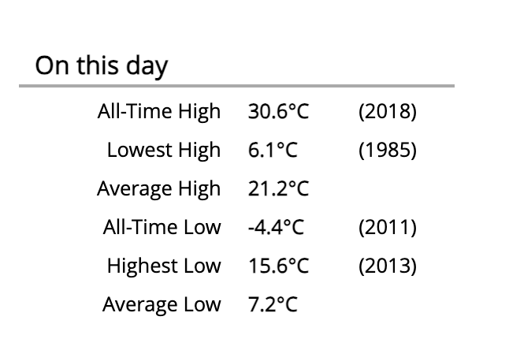

# Climate downloader

## About

This extension allows you to add climatological data, such as record highs and
lows for a day, to a skin. It works by downloading climatological data from
government sources, storing them in a local database, then making them available
as a search list extension. Here's an example of what is possible:



While the architecture can support multiple download sources, this first version
supports only the US-centric [ACIS database](https://www.rcc-acis.org/). In the
future, I hope to add support for other countries.

## Prerequisites

- Python 3.7+

## Installation

### Station ID

You will need to find the ACIS station ID of a nearby climatology station from
which to download data. The extension accepts many different kinds of IDs, but
one of the more accessible is the list of [Global Historical Climatology Network
daily (GHCNd)](https://www.ncei.noaa.gov/pub/data/ghcn/daily/ghcnd-stations.txt)
stations. Scan the list for a nearby station. Only USA stations will work.

A more graphical interface is available at the [NOAA National Center for
Environmental Information's](https://www.ncei.noaa.gov/access/past-weather/)
page. Zoom into a location of interest, then click on "Search this area". A
list of stations will appear. Note the station ID next to the station that
interests you.

You can find more information about your chosen station in the NOAA
[Historical Observing Metadata Repository](https://www.ncei.noaa.gov/access/homr/).

### Installing the extension

#### Run the installer

The extension is installed like any other WeeWX extension:

```shell
weectl extension install https://github.com/tkeffer/weewx-climate/archive/refs/heads/master.zip 
```
#### Configure the extension

Now you need to configure the extension to use the station ID that you chose
above.
.
Go into `weewx.conf` and look for the stanza `[Climate]`. It will look something
like this:

```
[Climate]
    # Replace with the ACIS ID of a nearby station. See the README for more info.
    [[USC00040983]]
        enabled = true
        downloader = user.climate.acis
```

Replace the station ID `USC00040983` (which is actually for Borrego Springs, CA)
with your chosen ID.

## Demonstration skin

A demonstration skin called "Climate" is included and will be installed when
you install the extension. It demonstrates how to use the tags. By default,
it is not enabled.

## Adding to the Seasons skin

The climate extension can be added easily to the Seasons skin. Here's how to do
it. 

The installation process will automatically add a widget file to the Seasons
skin called "`climate.inc`". However, to actually use it, you must make two
changes to the Seasons skin manually:

1. Look in `Seasons/index.html.tmpl` for a section that looks like this:
    ```
      <div id="widget_group">
        #include "current.inc"
        #include "sunmoon.inc"
        #include "hilo.inc"
        #include "sensors.inc"
        #include "about.inc"
        #include "radar.inc"
        #include "satellite.inc"
        #include "map.inc"
      </div>
   ```
   
    Add the climate widget to the list. When you're done, it should look like this:
    ```
      <div id="widget_group">
        #include "current.inc"
        #include "sunmoon.inc"
        #include "hilo.inc"
        #include "climate.inc"
        #include "sensors.inc"
        #include "about.inc"
        #include "radar.inc"
        #include "satellite.inc"
        #include "map.inc"
      </div>
   ```
    Note the addition of "`climate.inc`" to the list.

2. Edit the stanza `[CheetahGenerator] in the file `skin.conf` in the Seasons
   skin directory such that it can use the climate search list extension. When
   you're done, it should look like this:

    ```
    [CheetahGenerator]
    
        # Possible encodings include 'html_entities', 'strict_ascii', 'normalized_ascii',
        # as well as those listed in https://docs.python.org/3/library/codecs.html#standard-encodings
        encoding = html_entities
        search_list_extensions = user.climate.clsle.ClimateSLE
   ```
   
That's it!

## Tags

Here are some sample tags that you can use in your skin.

```
$climate.station_id               <-- Station ID
$climate.name                     <-- Station name
$climate.location                 <-- Station location
$climate.latitude                 <-- Latitude of station
$climate.longitude                <-- Longitude of station
$climate.altitude                 <-- Altitude of station

$climate.day.precip.sum.max       <-- Max precip for this day
$climate.day.precip.sum.maxtime   <-- Year of the max precip
$climate.day.outTemp.high.max     <-- Max high (high-high) temperature for this day
$climate.day.outTemp.high.maxtime <-- Year of the max high temperature
$climate.day.outTemp.high.avg     <-- Average high temperature for this day
$climate.day.outTemp.low.avg      <-- Average low temperature for this day
$climate.day.outTemp.low.max      <-- Max low (high-low) temperature for this day
          │    │      │   │
          │    │      │   └─── reduction
          │    │      └─────── stat
          │    └────────────── obs_type
          └─────────────────── period
```

## Using more than one climate station

It is possible to download data from more than one climatological station.
Simply add more stanzas to the `[Climate]` section of `weewx.conf`. For example,
to download data from both the SJC and SFO airports in the San Francisco, CA
area, your `[Climate]` section would look like this:

```
[Climate]
    # SJC airport:
    [[USW00023293]]
        enabled = true
        downloader = user.climate.acis

    # SFO airport:
    [[USW00023234]]
        enabled = true
        downloader = user.climate.acis
```

The first station listed will be the "default" station. Other stations can be
referenced by adding a `station_id` parameter to `$climate`. For example,

    $climate.day.precip.sum.max

would return the maximum precipitation for the default station, which is SJC,
while

    $climate(station_id=USW00023234).day.precip.sum.max

would return the maximum precipitation for SFO.

## Database schema

Climatological data is stored in a SQLite database called `climate.sdb`, located
in `SQLITE_ROOT`. For reference, here's what the table `climate_data` inside the
database, looks like:

```
station_id  month day usUnits obsType stat reduction value year
USC00040983    01  01       1 outTemp high       min    41 2018
USC00040983    01  01       1 outTemp high       avg    38 null
USC00040983    01  01       1 outTemp high       max    55 2004
USC00040983    01  01       1  precip  sum       avg  0.12 null
USC00040983    01  01       1  precip  sum       max  3.24 2009
...
```

